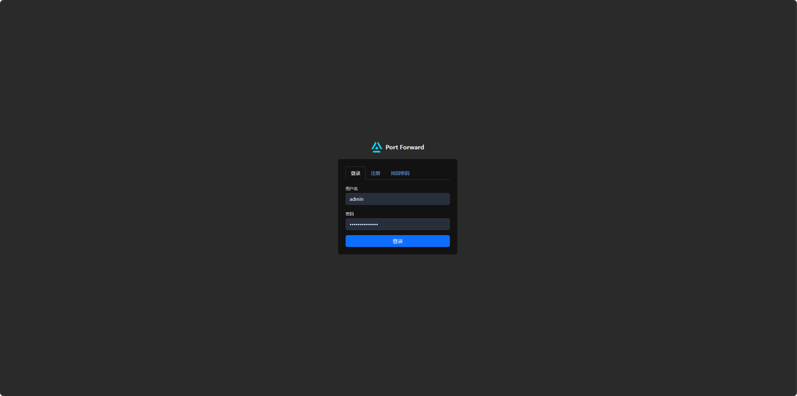
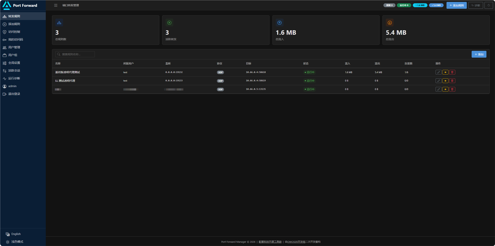
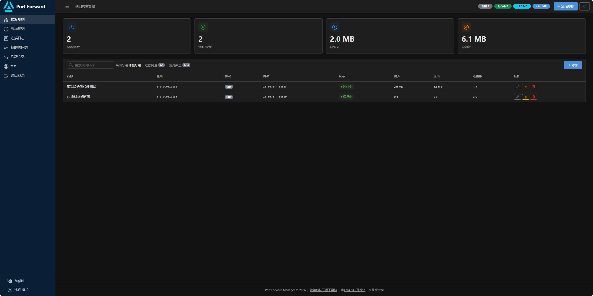
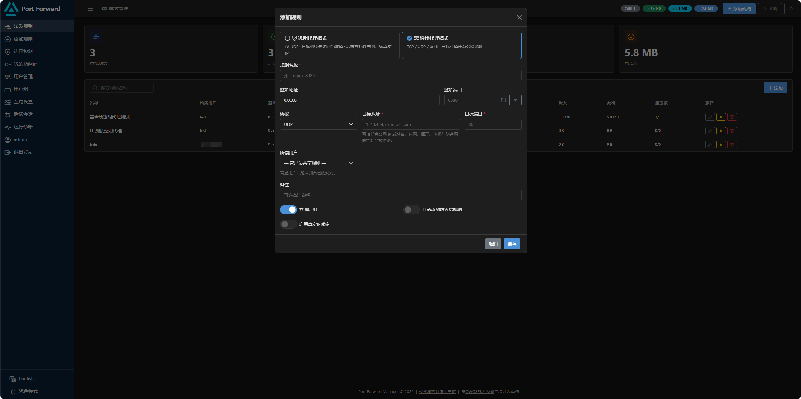
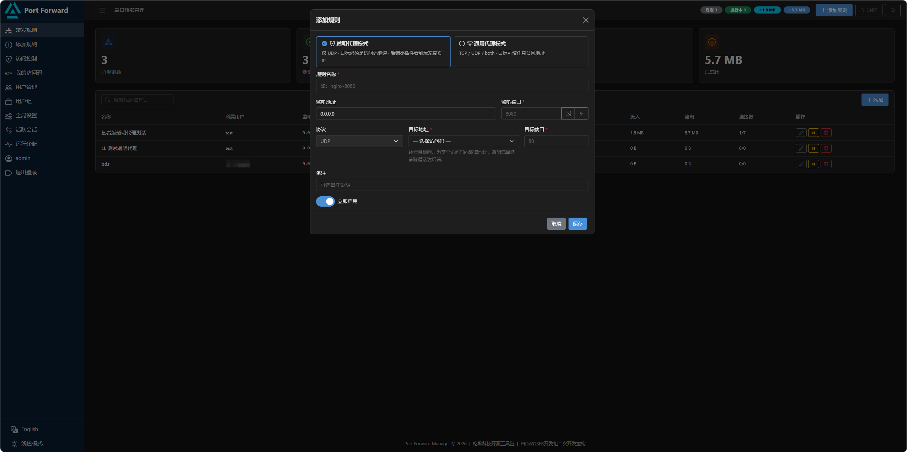
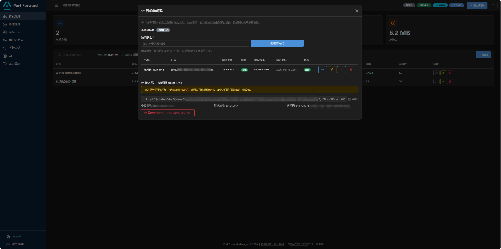
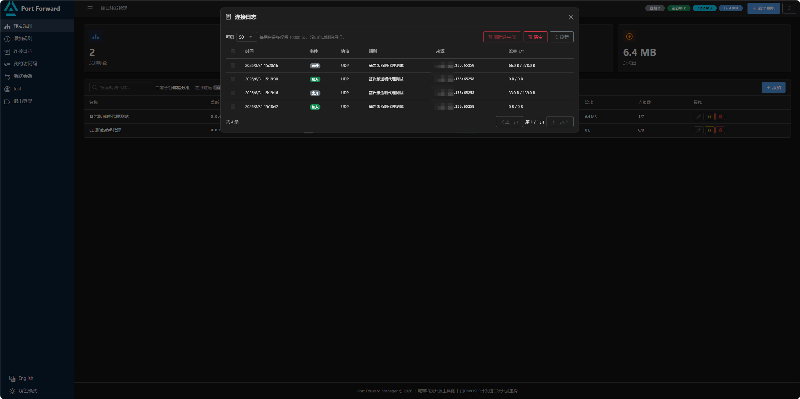

# Port Forward

**高性能多用户端口转发面板** —— TCP/UDP 端口转发 · 多用户与访问码 · 加密隧道与透明模式。

A high-performance multi-user port-forwarding panel — TCP/UDP forwarding, multi-user access codes, and an encrypted tunnel with transparent mode.

> 本项目 fork 自 [shibingli/go-port-forward](https://github.com/shibingli/go-port-forward)，由 **OWOSER 开发组**二次开发重构：在原有单机转发面板之上，新增了多用户与访问码体系、用户组配额、内置加密隧道服务端与 Windows 隧道客户端（透明模式）、连接日志、自助注册与 SMTP 邮件等能力。
>
> This is a fork of [shibingli/go-port-forward](https://github.com/shibingli/go-port-forward), rebuilt by the **OWOSER team**: multi-user access codes, group quotas, a built-in tunnel server plus a Windows tunnel client (transparent mode), per-user connection logs, self-service registration with SMTP email, and more.

## 源码地址 | Source Code

| 平台 | 地址 Address |
|--------------|----------------------------------------------|
| 🌐 GitHub | <https://github.com/272416939/go-port-forward> |
| 🪞 Gitee 镜像 | <https://gitee.com/Allen0528/go-port-forward> |
| ⬆️ 上游原版 Upstream | <https://github.com/shibingli/go-port-forward> |

## 📸 截图 | Screenshots

### 登录页（登录 / 注册 / 找回密码）| Login


### 管理页（管理员视角）| Admin Dashboard


### 用户端页面（普通用户视角）| Regular User View


### 添加规则 · 通用代理模式 | Add Rule · General Proxy


### 添加规则 · 透明代理模式 | Add Rule · Transparent Proxy


### 我的访问码与接入码 | My Access Codes


### 连接日志 | Connection Logs


Windows 隧道客户端 pf-client 的界面与使用说明见 [app/README.md](app/README.md)。
For the Windows tunnel client (pf-client) UI and usage, see [app/README.md](app/README.md).

## 🧭 两种代理模式 | Two Proxy Modes

理解本项目的核心是规则的两种模式——添加规则时的第一个选择：

The core concept of this project is the rule's **mode** — the first choice when adding a rule:

| | 通用代理模式 General Proxy | 透明代理模式 Transparent Proxy |
|---|---|---|
| 协议 Protocol | TCP / UDP / Both | 仅 UDP UDP only |
| 转发目标 Target | 任意公网 IP / 域名 Any public IP / domain | 下拉选择访问码（隧道地址） Pick an access code (tunnel address) |
| 后端看到的源地址 Source seen by backend | 中转机的 IP The relay's IP | **玩家的真实 IP The player's real IP** |
| 后端配合 Backend requirement | 无（或装 PROXY v2 插件） None (or a PROXY v2 plugin) | 需在 Windows 后端运行 pf-client Requires pf-client on the Windows backend |
| 服务端环境 Server host | 任意 Any | 仅 Linux + root |
| 典型用途 Typical use | 网站、TCP 服务对外发布 Websites / TCP services | 基岩版等 UDP 游戏服「真 IP」中转 Real-IP relay for UDP game servers (e.g. Minecraft Bedrock) |

## ✨ 功能特性 | Features

**转发与网络 | Forwarding & Networking**

- **TCP / UDP / Both** 三种协议组合，一套规则双协议同时转发
  TCP / UDP / Both with dual-protocol forwarding in one rule
- **通用代理**：目标可填任意公网地址，内网 / 回环 / 本机 / 隧道网段地址一律拒绝（防跳板与 SSRF）
  General proxy targets any public address; private / loopback / tunnel-network targets are rejected (anti-jump-host & SSRF)
- **透明代理**：配合隧道组件，后端零插件看到玩家真实 IP
  Transparent proxy delivers real client IPs to the backend with zero plugins, via the tunnel
- **真实 IP 透传（PROXY Protocol v2）**：向支持该协议的目标注入携带客户端真实 IP 的头（TCP 流首部 / UDP 会话首包）
  Real IP passthrough (PROXY Protocol v2) for protocol-aware backends
- **跨平台防火墙管理**：Windows (netsh)、Linux (iptables)、macOS (pfctl) 自动添加 / 清理放行规则
  Cross-platform firewall management — auto add/remove rules on netsh / iptables / pfctl
- **端口工具**：在配额区间内随机挑选可用端口、服务端真实试绑检测端口占用
  Port tools — random free port within your quota range, real server-side bind check

**多用户与配额 | Multi-user & Quotas**

- **多用户 + 访问码**：面板账号与隧道身份分离；一个用户可建多个访问码，每个访问码是一条独立隧道、绑定一台设备
  Panel accounts vs. tunnel identities: multiple access codes per user, each an independent tunnel bound to one device
- **用户组配额**：端口区间、访问码数、并发隧道数、规则数，全局设置是天花板；界面上显示用量与来源
  Group-based quotas (port range, code / tunnel / rule limits) under a global ceiling, with usage and origin shown in the UI
- **自助注册与邮件**：开放注册开关、邮箱验证码注册、找回密码、账号页绑定 / 更换邮箱（SMTP 可选配置，密码永不回显）
  Self-service registration with email verification, password reset, and email binding (optional SMTP; passwords never echoed)
- **租户隔离**：普通用户只见自己的规则 / 日志 / 会话；越权读取返回 404；数据面按源地址强校验
  Tenant isolation: own-rules-only visibility, 404 on foreign IDs, data-plane source validation

**隧道与透明模式 | Tunnel & Transparent Mode**

- **内置隧道服务端**（Linux 主程序内，无独立进程）+ **Windows 客户端 pf-client**（WebView2 图形界面 + 系统托盘常驻）
  Built-in tunnel server (no separate process) + Windows client with WebView2 UI and tray
- 每访问码独立密钥、独立隧道内地址；X25519 密钥协商 + NaCl 每包加密；设备指纹绑定
  Per-code keys and addresses, X25519 + NaCl per-packet encryption, device fingerprint binding
- **动态 /32 回程路由**：只有正在中转的玩家 IP 走隧道返回，后端机器的其它流量完全不受影响
  Dynamic /32 return routes: only actively relayed player IPs route through the tunnel

**可观测 | Observability**

- **连接日志**：加入 / 离开事件按用户隔离存储，分页浏览，可勾选删除 / 清空，每用户保留上限自动裁剪
  Per-user connection logs with pagination, selective delete / clear, and automatic retention trimming
- **活跃会话**：conntrack 风格的实时会话视图（协议 / 来源 / 规则 / 流量），5 秒自动刷新
  Conntrack-style live session view, auto-refreshed every 5 seconds
- **IP 黑白名单**：单 IP / CIDR 的拒绝 / 放行条目，作用于全部或单条规则
  IP / CIDR allow / deny entries scoped to all or one rule
- **运行诊断**：runtime、协程池、规则健康、热点 / 错误规则榜单，一键定位，JSON 快照导出
  Diagnostics panel — runtime, pool, rule health, hot / error rules, drill-down, JSON snapshot export

**工程 | Engineering**

- **Web 管理界面**：Alpine.js + Bootstrap 5 单页应用，中英双语、明暗主题，全部静态资源 embed 进单个二进制
  Web UI — Alpine.js + Bootstrap 5 SPA, bilingual (中文/EN) with light/dark themes, embedded into a single binary
- **bbolt 嵌入式存储**：零外部依赖，重启自动恢复全部规则
  bbolt embedded KV storage — zero dependencies, rules auto-restored on restart
- **高性能**：[ants](https://github.com/panjf2000/ants) 协程池 + 字节缓冲池，高并发下内存可控
  High concurrency via the ants goroutine pool and byte-buffer pool
- **自动 GC 管理**：定时 + 内存阈值触发，多种回收策略
  Automatic GC — scheduled + memory-threshold triggered, multiple strategies
- **系统服务**：Windows Service / systemd / launchd 一键注册
  Register as Windows Service / systemd / launchd
- **WSL2 端口导入**（Windows 管理员）：自动发现发行版监听端口并批量建规则
  WSL2 port import (Windows admin) — auto-discover distro ports and import in bulk

## 🎯 应用场景 | Use Cases

1. **游戏服务器公网中转（旗舰场景）| Game server relay (flagship)**
   游戏服在海外 / 内网 Windows 机器上，玩家直连延迟高或不可达。中转 Linux VPS 上跑本面板，后端机跑 pf-client 建隧道，规则开透明模式——玩家流量经中转进入游戏服，**后端零插件看到玩家真实 IP**，封禁、日志、展示都不缺真数据。
   Relay player traffic through a Linux VPS to a Windows game server via the tunnel; with transparent mode the backend sees each player's real IP with no plugins.

2. **WSL2 开发环境端口暴露 | WSL2 dev ports**
   WSL2 内的服务默认局域网不可达且 IP 常变。自动发现监听端口、一键导入规则、重启自动恢复。
   Auto-discover WSL2 listening ports, import in one click, auto-restore on reboot.

3. **内网服务统一转发网关 | Intranet forwarding gateway**
   多台内网服务器的端口集中到一台网关机器上转发与管理，Web UI 总览状态与流量。
   Centralize and manage service ports from one gateway machine.

4. **容器 / 虚拟机端口映射 | Container / VM mapping**
   Docker、VMware/VirtualBox 的 NAT / Host-Only 网络端口对外发布，不改容器与虚拟机配置。
   Publish ports of NAT'd containers / VMs without touching their network config.

5. **远程调试与演示 | Remote debugging**
   把本地 `127.0.0.1:3000` 暴露给异地同事，配合自动防火墙放行一键完成。
   Expose a local service to remote teammates with automatic firewall rules.

6. **轻量级四层网关 | Lightweight L4 gateway**
   不需要 Nginx/HAProxy 完整反向代理的场景（纯 TCP 数据库代理、IoT 网关），单二进制、资源占用极低。
   A lightweight Layer-4 gateway where a full reverse proxy is overkill.

## 🚀 快速开始 | Quick Start

### 下载 | Download

从 [Releases](https://github.com/272416939/go-port-forward/releases) 下载对应平台的压缩包，或自行编译。
Grab a platform archive from [Releases](https://github.com/272416939/go-port-forward/releases) or build it yourself.

### 编译 | Build

```bash
# Linux / macOS
bash build.sh              # 构建所有平台 | Build all platforms
bash build.sh linux        # 仅构建 Linux | Linux only
bash build.sh windows      # 仅构建 Windows | Windows only
bash build.sh darwin       # 仅构建 macOS | macOS only
```

```powershell
# Windows (PowerShell)
.\build.ps1                # 构建所有平台 | Build all platforms
.\build.ps1 -Target linux  # 仅构建 Linux | Linux only
```

支持 windows / linux / darwin × amd64 / arm64 / arm 共 7 个平台，产物输出到 `dist/`（含可执行文件、`config.yaml.example` 与 SHA256 校验文件）。可用 `VERSION=v1.0.0` 环境变量指定版本号。

7 platforms (windows / linux / darwin × amd64 / arm64 / arm) are built into `dist/` with executables, a `config.yaml.example`, and SHA256 checksums. Set `VERSION=v1.0.0` to override the version string.

### 运行 | Run

```bash
./go-port-forward                              # 前台运行 | Foreground
./go-port-forward -config /path/to/config.yaml # 指定配置 | Custom config
```

启动后访问 `http://127.0.0.1:8989` 打开 Web 管理界面。首次启动会自动创建管理员 `admin` 并生成随机密码（写入启动日志与同目录 `admin-credentials.txt`，首次登录强制改密，改完请删除该文件）。

Visit `http://127.0.0.1:8989` for the Web UI. On first run an `admin` account is created with a random password (written to the startup log and `admin-credentials.txt` next to the executable; you must change it on first login, then delete the file).

### 系统服务 | System Service

```bash
./go-port-forward -service install    # 安装 | Install
./go-port-forward -service run        # 以服务运行 | Run as service
./go-port-forward -service uninstall  # 卸载 | Uninstall
```

### CI/CD 自动发布 | Automated Release

推送 `v{major}.{minor}.{patch}` 格式的 tag（可带 `-后缀`，自动标记 Pre-release）会触发 GitHub Actions：7 平台编译 → 打包 → SHA256 → 创建 Release 并上传。

Pushing a `v*.*.*` tag (a `-suffix` marks it Pre-release) triggers GitHub Actions: 7-platform build → archive → SHA256 → Release upload.

```bash
git tag v1.0.0
git push origin v1.0.0
```

## ⚙️ 配置文件讲解 | Configuration

首次运行时会在可执行文件同目录自动生成 `config.yaml`；不指定 `-config` 时也从该目录查找。
A default `config.yaml` is auto-generated next to the executable on first run (also the default search path without `-config`).

生成的文件是**无任何注释、按键名字母序排列、4 空格缩进**的扁平 YAML；其中 `storage.path`
与 `log.path` 写的是以**可执行文件所在目录**为锚点的绝对路径。下面为了阅读方便写成相对
形式——例如可执行文件位于 `/www/wwwroot/FP` 时，实际生成的是
`/www/wwwroot/FP/data/rules.db` 与 `/www/wwwroot/FP/logs/app.log`。

The generated file is a flat YAML with **no comments, keys sorted alphabetically, 4-space
indent**; `storage.path` and `log.path` are written as absolute paths anchored at the
executable's directory (shown relative below for readability).

```yaml
forward:
    buffer_size: 32768
    connlog_max_entries: 2000
    dial_timeout: 10
    pool_size: 0
    udp_timeout: 30
gc:
    enable_monitoring: true
    enabled: true
    interval_seconds: 300
    memory_threshold_mb: 100
    strategy: standard
log:
    compress: true
    level: info
    max_age_days: 30
    max_backups: 5
    max_size_mb: 50
    path: logs/app.log
pool:
    pre_alloc: true
    size: 10000
storage:
    path: data/rules.db
tunnel:
    enabled: false
    listen: :7947
    nat: true
    psk: ""
    public_addr: ""
    tun_addr: 10.66.0.1/16
    tun_name: pftun0
web:
    host: 127.0.0.1
    port: 8989
    secure_cookie: false
```

两处与直觉预期不同：

- **`web.username` / `web.password` 默认不写入文件**——需要应急后门时手动加上这两行
  （仅从本机回环访问时生效；不加或留空即关闭）。
  `web.username` / `web.password` are absent from the generated file; add them manually to
  enable the loopback-only rescue account.
- **`tunnel.psk` 已废弃**：多用户协议为每个访问码分配独立密钥。新生成的文件里它是空串；
  旧配置带上它也能加载，但该项被忽略并在启动时告警一次。
  `tunnel.psk` is deprecated — every access code now carries its own key; the field is
  written empty and ignored with a one-time startup warning when present in old configs.

### 字段逐项讲解 | Field Reference

**web — 面板 Panel**

| 字段 Field | 默认 Default | 说明 Notes |
|---|---|---|
| `host` | `127.0.0.1` | 面板监听地址。多用户对外服务时改为 `0.0.0.0` 并放到 TLS 反代之后 Panel listen address; use `0.0.0.0` behind a TLS proxy |
| `port` | `8989` | 面板端口 Panel port |
| `secure_cookie` | `false` | 会话 cookie 加 Secure 标记。**仅在 HTTPS 访问时开启**——非 HTTPS 下开启会导致浏览器拒存 cookie、登录直接失败 Mark the session cookie Secure; enable ONLY behind HTTPS |
| `username` / `password` | （不写入 not written） | 应急后门账号：仅从本机回环访问时生效，忘记管理员密码时 SSH 到机器上救急；手动添加才生效 Loopback-only rescue account, enabled by adding the keys manually |

**storage / log — 存储与日志 Storage & Logging**

| 字段 Field | 默认 Default | 说明 Notes |
|---|---|---|
| `storage.path` | `<exe目录>/data/rules.db` | bbolt 数据库路径（规则/用户/访问码/日志/SMTP 全部在此） bbolt database path |
| `log.level` | `info` | `debug / info / warn / error`。例行日志已降为 debug，info 级日志很安静 routine logs are debug-level |
| `log.path` | `<exe目录>/logs/app.log` | 日志文件 Log file |
| `log.max_size_mb` / `max_backups` / `max_age_days` / `compress` | `50` / `5` / `30` / `true` | 滚动策略：单文件上限、保留份数、保留天数、归档压缩 rotation: size, backups, days, compression |

**forward — 转发 Forwarding**

| 字段 Field | 默认 Default | 说明 Notes |
|---|---|---|
| `pool_size` | `0` | 转发协程池容量，0 = 自动（CPU 数 × 64）forwarding goroutine pool, 0 = auto |
| `buffer_size` | `32768` | I/O 缓冲区大小（字节）I/O buffer (bytes) |
| `dial_timeout` | `10` | 出站连接超时（秒）outbound dial timeout (s) |
| `udp_timeout` | `30` | UDP 会话空闲超时（秒），超时会话回收、下个包新建 UDP session idle timeout (s) |
| `connlog_max_entries` | `2000` | 连接日志保留上限的**兜底值**；正式生效值在面板「全局设置 → 每用户日志保留上限」（默认 10000 条，环形裁剪最旧） fallback cap; the effective per-user cap lives in Global Settings (default 10000 rows) |

**pool / gc — 协程池与内存回收 Pool & GC**

| 字段 Field | 默认 Default | 说明 Notes |
|---|---|---|
| `pool.size` | `10000` | 全局协程池容量 global goroutine pool capacity |
| `pool.pre_alloc` | `true` | 启动时预分配 pre-allocate at startup |
| `gc.enabled` / `interval_seconds` | `true` / `300` | 周期性 GC 与间隔（秒）periodic GC and interval (s) |
| `gc.strategy` | `standard` | `standard` 标准 / `aggressive` 激进（GC 后向操作系统归还内存）/ `gentle` 温和（仅内存压力大时执行）/ `adaptive` 自适应（按内存增长速度调整） |
| `gc.memory_threshold_mb` | `100` | 内存阈值触发 GC，0 = 关闭 threshold-triggered GC (MB), 0 = off |
| `gc.enable_monitoring` | `true` | 性能监控 performance monitoring |

**tunnel — 内置隧道服务端 Tunnel Server**（配合 Windows 客户端 pf-client 与透明模式）

| 字段 Field | 默认 Default | 说明 Notes |
|---|---|---|
| `enabled` | `false` | 开启后隧道服务端随主程序常驻（完整回程配置仅 Linux 生效，见透明模式章节） tunnel server embedded in the main process |
| `listen` | `:7947` | 隧道 UDP 监听，记得在防火墙放行 tunnel UDP listen (allow it in the firewall) |
| `tun_name` | `pftun0` | TUN 设备名 TUN device name |
| `tun_addr` | `10.66.0.1/16` | 服务端隧道地址 + 访问码地址池。/16 约 6.5 万个地址（一个访问码占一个）；/24 只有 253 个，几十个用户就会耗尽。旧部署写死 /24 的不受影响 server address + access-code address pool |
| `public_addr` | （空 empty） | 兜底用：写进接入码的中转机地址，如 `1.2.3.4` 或 `relay.example.com:7947`。优先用面板「全局设置 → 中转机地址」；两处都未配置时自动探测公网 IP（面板域名经 CDN/反代时务必显式配置，探测会把 CDN 地址写进接入码） fallback relay address embedded in access codes |
| `nat` | `true` | 自动配置回程路径：ip_forward + fwmark 策略路由 + FORWARD/INPUT 规则。**不使用 MASQUERADE**（透明模式下正向首包走 OUTPUT，conntrack 会判定整流不 NAT） auto-configure the return path; deliberately no MASQUERADE |

## 🖥️ 面板功能指南 | Panel Guide

界面为单页应用：左侧栏切换功能（随角色显示不同项），底部有**中英切换**与**明暗主题切换**；顶部徽标实时显示规则数 / 运行中转发 / 上下行流量。

The UI is a single-page app: the sidebar switches between features (role-dependent), with **language** and **light/dark theme** toggles at the bottom; header badges show live rule count / active forwarders / traffic.

### 登录 / 注册 / 找回密码 | Sign in / Register / Reset

登录页三个标签页：

- **登录**：用户名 + 密码。连续失败会按 IP 与用户名两个维度限频锁定（15 分钟）。
- **注册**：仅在管理员开启「开放注册」后可见。SMTP 已配置时必须邮箱 + 验证码注册；未配置时仅用户名 + 密码。新账号落入默认用户组，配额由组决定。
- **找回密码**：SMTP 已配置时可用——填用户名/邮箱，收验证码后重置；未配置时只能找管理员重置。

Three tabs on the login page:

- **Sign in**: username + password. Failures are rate-limited and locked per IP and per username (15 min).
- **Register**: visible only when "Open Registration" is enabled. With SMTP configured, an email verification code is required; without it, username + password only. New accounts join the default group.
- **Reset password**: available with SMTP configured; otherwise an admin must reset it.

登录后即可在侧边栏底部的「我的账号」处进入账号页：修改密码、绑定 / 更换邮箱（需 SMTP，收验证码确认）、查看自己的配额用量与来源。

After signing in, open **My Account** at the bottom of the sidebar to change your password, bind / change your email (requires SMTP), and see your quota usage and origin.

### 转发规则（首页）| Rules (Home)

首页上半部分是四张统计卡片（总规则数 / 活跃转发 / 总流入 / 总流出），下半部分是规则表：名称、监听、协议、目标、状态、流入 / 流出、连接数与操作按钮（编辑 / 暂停 / 删除）。工具条从左到右：**搜索框 → 当前分组 → 在线隧道 → 规则数量**（普通用户显示，形如 `2/10`，含组配额来源）。

The home page has four stat cards (rules / active forwarders / traffic in / out) above the rule table (name, listen, protocol, target, status, traffic, connections, actions). The toolbar reads **search → current group → online tunnels → rule count** (e.g. `2/10` with its quota origin, for regular users).

- 管理员视角多一列**所属用户**；普通用户只能看到自己名下的规则。
  Admins additionally see the rule's owner; regular users see only their own rules.
- 状态列显示 `运行中` / `已停止` / 错误；出错时把鼠标悬停或打开「运行诊断」查看原因。
  Status shows running / stopped / error; hover or open Diagnostics for the cause.

### 添加 / 编辑规则 | Add / Edit a Rule

点侧边栏「添加规则」或工具条「＋添加」。表单第一个选择就是**模式卡片**：

Click **Add Rule**. The first choice in the form is the **mode card**:

**通用代理模式（TCP/UDP/Both，目标任意公网地址）**

| 字段 Field | 说明 Notes |
|---|---|
| 规则名称 Name | 必填，如 `nginx-8080` |
| 监听地址 Listen addr | 默认 `0.0.0.0`；只对本机服务可填 `127.0.0.1` |
| 监听端口 Listen port | 必填。旁有两个按钮：**🎲 随机**——在自己配额区间内挑一个当前可用的端口直接填入；**⚡检测**——服务端真实试绑 TCP+UDP 判断端口是否空闲。普通用户只能随机 / 检测**自己配额区间内**的端口。bind 检测存在「检测后、保存前被抢占」的窗口，以保存时的实际结果为准 |
| 协议 Protocol | TCP / UDP / Both |
| 目标地址 Target | 公网 IP 或域名。内网、回环、本机与隧道网段地址会被拒绝（防把中转机变成跳板） |
| 目标端口 Target port | 必填 |
| 所属用户 Owner | 仅管理员可见：「管理员共享规则」或指定某用户；普通用户只能建自己的规则 |
| 备注 Note | 可选 |
| 开关 Toggles | **立即启用**；**自动添加防火墙规则**（创建 / 删除规则时同步放行 / 清理端口）；**启用真实IP透传**（PROXY v2，见下文） |

**透明代理模式（仅 UDP，目标锁定访问码隧道）**

- 协议锁定为 **UDP**（透明回程依赖 UDP conntrack，TCP 无法经隧道送达透明 socket）。
- 「目标地址」变成**访问码下拉框**：选定某个访问码后，转发目标即固定为该访问码的隧道地址（如 `10.66.0.4:19132`），玩家流量以玩家真实 IP 经隧道送达后端。
- 普通用户只能选**自己的**访问码；管理员先在「所属用户」选定用户，再从该用户的访问码中选择。
- 保存时若服务端不是 Linux + root，该规则会启动失败并给出明确原因（fail-closed，不会静默降级）。

**General proxy mode** (TCP/UDP/Both, any public target): fields are name, listen address (default `0.0.0.0`), listen port with 🎲 random and ⚡ check buttons (scoped to your quota range; results are indicative — saving is authoritative), protocol, target address (public IP/domain only — private, loopback and tunnel-network targets are rejected), target port, owner (admin: shared or a specific user), note, and toggles: enable now, auto firewall rules, and PROXY v2 passthrough.

**Transparent proxy mode** (UDP only, target locked to a tunnel): the protocol is locked to UDP, and the target becomes an **access-code dropdown** — the rule forwards to that code's tunnel address with the player's real IP as the source. Regular users only see their own codes; admins pick the owner first. On a non-Linux/non-root server the rule fails to start with a clear reason (fail-closed).

### 连接日志 | Connection Logs

侧边栏「连接日志」（管理员在「访问控制」弹窗的第二个标签页）记录每次会话的**加入 / 离开**事件：时间、事件、协议、规则、来源 IP:端口、双向流量。支持：

- **分页**：每页 20 / 50 / 100 / 200 条；
- **勾选删除**与**一键清空**（作用域与列表一致——普通用户只能动自己的）；
- **刷新**；管理员对非离开事件可**一键封禁该 IP**（现存会话不受影响，新连接被拒绝）；
- 每用户保留上限由「全局设置」控制（默认 10000 条，超出自动裁掉最旧），界面会显示当前配置。

The **Connection Logs** panel records join / leave events per session: time, event, protocol, rule, source, traffic. It supports pagination (20/50/100/200 per page), selective delete and clear (scoped to your own logs for regular users), refresh, and — for admins — a one-click **ban this IP** action on join events. Retention is capped per user via Global Settings (default 10000 rows, oldest trimmed).

### 活跃会话 | Active Sessions

当前所有客户端会话的实时视图：协议 / 来源 / 规则 / 建立时间 / 实时流量，TCP 与 UDP 通用，每 5 秒自动刷新。普通用户只见自己规则上的会话；管理员可对会话来源一键封禁。

A conntrack-style live view of all client sessions (protocol / source / rule / uptime / traffic), auto-refreshed every 5 seconds. Regular users see their own rules' sessions; admins can ban a source directly.

### 我的访问码 | My Access Codes

每个访问码是一条独立隧道：独立的隧道内地址、独立密钥、首次连接后绑定一台设备。

- **创建**：填个名字即可（如「家里的服务器」），数量受「访问码额度」（形如 `已创建 1/3`，含来源）约束。
- **列表**：名称、归属（管理员代管视角）、隧道地址（`10.66.0.x`）、隧道在线状态、绑定设备指纹、最近活跃时间、状态（正常 / 停用）。
- **接入码**：点「接入码」查看并复制整串凭据——`pf1.` 开头的字符串，内含中转机地址、访问码 ID 与隧道密钥，粘贴进 pf-client 即可连接。**接入码等同于密码**，请通过安全渠道交付。
- **解绑设备**：换机器时先在面板点「解绑」（当前在线隧道立即断开），再到新机器连接即自动绑定新设备。
- **重新生成密钥**：怀疑泄漏时使用，旧接入码与在线隧道立即失效。
- **停用 / 删除**：停用后该码无法建立新连接；删除被规则引用的访问码会被拒绝（409），先改规则再删。

Each access code is an independent tunnel: its own tunnel address, its own key, bound to one device after first connection. Create one with just a name (within your quota, origin shown); copy the `pf1.` **access code** (relay address + code ID + tunnel key — treat it like a password); **unbind** the device before moving machines (disconnects immediately); **regenerate** the key if it leaks (old code dies instantly); deleting a code referenced by rules is refused (409).

### 管理员：访问控制 | Admin: Access Control

「访问控制」弹窗含两个标签页：

- **IP 黑白名单**：添加单 IP 或 CIDR（IPv4/IPv6）的「拒绝 / 放行」条目，可作用于全部规则或单条规则。判定顺序：命中任一 deny → 拒绝；作用域内存在 allow 且未命中 → 隐式拒绝；否则放行。所有变更实时生效（自动重载转发器内的匹配快照）。
- **连接日志**：见上文。

The **Access Control** panel has two tabs: **IP Rules** (per-IP/CIDR deny/allow entries scoped to all or one rule; a deny hit rejects, scoped allows imply default-deny; changes hot-reload into live forwarders) and **Connection Logs**.

### 管理员：用户管理 | Admin: Users

- 创建用户（用户名 / 初始密码 / 归属组）、停用 / 启用、删除、编辑邮箱激活状态；
- 查看每个用户的配额与用量；
- 进入某用户的**访问码列表代管**（创建 / 取接入码 / 解绑 / 重新生成密钥）；
- 停用、改密、删除会**立即注销该用户的登录会话**并断开其隧道。

Create users (username / password / group), enable / disable, delete, edit email activation state, review usage, and manage a user's access codes on their behalf. Disabling, deleting, or changing a password immediately revokes that user's sessions and tears down their tunnels.

### 管理员：用户组 | Admin: Groups

用户组是配额的载体：建组时填**端口区间**与**访问码上限 / 并发隧道上限 / 规则上限**。组内某项填 **0** 表示取全局默认；全局也为 0 表示不限。组的区间与上限**不能突破全局设置**（保存时校验）；收紧全局天花板时若有组越界会被拒绝并列出冲突的组名。给个别用户特殊待遇的正确方式是给他建一个专属组。

Groups carry the quotas: port range plus code / tunnel / rule limits, where 0 falls back to global (and global 0 means unlimited). Group quotas may not exceed the global ceiling (validated on save; tightening the ceiling is refused while any group breaches it). To give one user special treatment, create a dedicated group.

### 管理员：全局设置 | Admin: Global Settings

| 配置 | 说明 |
|---|---|
| 全站端口区间 | 可分配监听端口的天花板，用户组区间必须落在其内（默认 20000–29999） |
| 访问码 / 并发隧道 / 规则上限 | 组未单独配置时的兜底值，0 = 不限 |
| 每用户日志保留上限 | 100 ~ 1000 万条，超出裁最旧；不做「不限」防日志刷爆磁盘 |
| 默认用户组 | 自助注册新账号落入的组 |
| 开放注册 | 控制登录页注册入口，默认**关闭**（fail-closed） |
| 中转机地址 | 写进接入码的中转机地址（`host` 或 `host:port`）。留空则自动探测公网 IP；面板域名经 CDN/反代时**必须显式配置**，否则接入码指向 CDN、客户端连不上隧道 |

Global Settings holds the site-wide ceiling (port range, per-user code/tunnel/rule limits), the per-user log retention cap (100–10M rows), the default group for self-registered accounts, the **Open Registration** switch (off by default), and the **relay address** embedded into access codes — set it explicitly when the panel sits behind a CDN/reverse proxy, otherwise codes would point at the CDN.

### 管理员：运行诊断 | Admin: Diagnostics

侧边栏「运行诊断」打开实时诊断面板：

- **Runtime**：goroutines、堆内存、GC 次数与暂停、线程数；**Goroutine Pool**：运行 / 空闲 / 容量
- **Manager / Rule Health**：规则数、活跃转发器、状态分布、总连接与流量；**协议统计**：TCP / UDP 分列
- **热点规则**（按活跃连接 / 流量 / 总连接综合排序）、**Top Active / Traffic / Error Rules**、**错误规则摘要**（错误信息、次数、最近报错时间）
- 点击任意规则项**定位**到规则表并打开编辑弹窗（可切换「仅定位」模式）；支持**复制 / 下载 JSON** 快照留档
- 弹窗打开期间自动轮询刷新，关闭即停

The Diagnostics modal shows runtime & GC stats, goroutine-pool status, rule health with TCP/UDP splits, hot-rule leaderboards, and an error summary. Click any entry to drill down to the rule table (locate-only mode available), and export the snapshot as JSON. It auto-polls while open.

### 管理员：WSL2 端口导入 | Admin: WSL2 Import

Windows 上侧边栏会出现「WSL2 导入」（其它平台隐藏）：自动探测本机 WSL2 发行版与其监听端口，勾选后批量创建转发规则，重启后面板自动恢复。Linux/macOS 上相关 API 返回 `501`。

On Windows, the sidebar shows **WSL2 Import**: it probes local distros and their listening ports, and batch-creates forwarding rules (auto-restored on restart). The APIs return `501` on other platforms.

## 👥 多用户与账号体系 | Multi-user & Accounts

```
全局设置 Settings（配额天花板）
   └─ 用户组 UserGroup（配额载体）
        └─ 用户 User（登录账号，归属某组）
             └─ 访问码 AccessCode（隧道身份：独立密钥/隧道地址/绑定一台设备）
```

面板账号（User）与隧道身份（AccessCode）是两个实体：**一个用户可以有多个访问码，每个访问码是一条独立隧道**。用户登录后只能看到自己的转发规则；隧道只接受用某个访问码的接入码建立的连接。

A panel account (User) and a tunnel identity (AccessCode) are separate entities: one user can own multiple access codes, each being an independent tunnel. Users see only their own rules; the tunnel only accepts connections opened with an access code.

### 权限边界 | Permissions

| 能力 Capability | 管理员 Admin | 普通用户 User |
|---|---|---|
| 转发规则增删改查 CRUD on rules | 全部规则 All | 仅自己名下 Own only |
| 监听端口 Listen port | 不限 Unlimited | 必须落在组配额区间内 Within the group's range |
| 转发目标 Target address | 任意公网主机 Any public host | 通用模式=任意公网地址；透明模式=自己的访问码 Own codes (transparent) / public targets (general) |
| 规则 / 访问码数量 Rule & code count | 不限 Unlimited | 受组配额约束 Bounded by group quotas |
| 并发隧道数 Concurrent tunnels | 不限 Unlimited | 受组配额约束 Bounded by group quota |
| 访问码管理（建/删/解绑/重置） | 为任何人代管 On behalf of anyone | 仅自己的 Own only |
| 连接日志 / 活跃会话 Logs & sessions | 全站 All | 仅自己规则上的 Own rules only |
| IP 黑白名单 / 运行诊断 / WSL 导入 / 用户组 / 全局设置 | ✅ | ❌ |
| 用户管理 User management | ✅ | ❌ |

普通用户的转发目标被锁定不是形式主义：不限制的话，他可以建一条指向 `127.0.0.1:22` 或内网任意主机的转发，把中转机变成对外开放的跳板。读别人的资源返回 **404 而不是 403**——确认某个 ID 存在本身就是信息泄漏。隔离不只做在 API 层：隧道数据面对每个入向包校验源地址必须等于该会话分到的隧道地址，伪造他人源地址的包会被直接丢弃。

Target locking is not ceremony: without it a user could forward to `127.0.0.1:22` and turn the relay into a jump host. Foreign IDs return **404, not 403** (existence is information). Isolation is also enforced in the data plane — every tunnel packet's source address must match the session's assigned address, and spoofed packets are dropped.

### 邮件（SMTP）| Email (SMTP)

管理员在「全局设置 → 邮件（SMTP）」配置发信服务器：主机、端口、加密方式（STARTTLS / SSL / 无）、账号密码、发件人与显示名。配置保存在服务端数据库，**密码保存后不再回显**（界面只显示「已配置」徽章），更新时密码留空即保留原值。配置完成后可发测试邮件验证连通性。注册验证码、找回密码、账号页换绑邮箱都依赖它；未配置时相关入口自动隐藏（fail-closed，不会收集不验证的邮箱）。

Admins configure the SMTP relay (host, port, STARTTLS/SSL/none, credentials, sender) under Global Settings. The password is never echoed after saving; leave it blank on update to keep the stored value. A test-email button verifies connectivity. Registration codes, password reset, and email rebinding depend on it; without SMTP those entries hide themselves (fail-closed).

### 安全提示 | Security Notes

- 多租户意味着面板必须对外可达（`web.host` 不再是 `127.0.0.1`）。**请把面板放在 TLS 反向代理之后**，并把 `web.secure_cookie` 设为 `true`（非 HTTPS 下开启会导致浏览器拒存 cookie、登录直接失败）。
- `web.username` / `web.password` 退位为**应急后门**，仅在从**本机回环**访问时生效——忘记管理员密码时 SSH 到中转机救急。它是一对明文存在配置文件里的凭据，对公网生效就是整个多租户体系上的洞，所以这个限制不可配置。
- 会话存在内存里，进程重启即全部失效；改密码、停用账号会立刻注销该用户所有设备的登录。写操作要求同源（cookie 为 `SameSite=Strict`，服务端另对带 `Origin`/`Referer` 的非 GET 请求做同源校验）。

Put the panel behind a TLS reverse proxy and set `web.secure_cookie: true`. The `web.username`/`web.password` pair is a **loopback-only rescue account** (not configurable beyond loopback — a plaintext pair reachable from the public internet would be a hole in the whole multi-tenant model). Sessions live in memory and drop on restart, password change, or account disable; writes are same-origin checked.

## 🌉 透明模式与隧道组件 | Transparent Mode & Tunnel App

自研迷你加密隧道（`app/`，Windows 客户端 pf-client + 主程序内置 Linux 服务端）把中转机与游戏后端「缝」成一个虚拟内网，随后规则级**透明模式**让后端零插件看到玩家真实 IP。

```
玩家P ──► [中转 Linux VPS]                          [Windows / 游戏服]
          go-port-forward（透明模式：                    ▲ pf-client
            源地址=P真实IP）──► 路由进 TUN ══加密隧道═════╝ (10.66.0.x)
          内置隧道服务端 (TUN 10.66.0.1)
          策略路由把回包交回透明 socket ──► 玩家P ◄──────┘
```

> 为什么需要隧道？透明代理要求后端回包原路回到中转机。跨公网两台独立 VPS 之间物理上做不到
> （后端的默认路由不经过中转机，回包直接从自己的公网口出去）；PROXY Protocol 又要求后端
> 装插件解析。隧道把两端接进同一个虚拟网段，回程有了通路，真实 IP 才能在后端「零插件」兑现。
> Why a tunnel? Transparent proxying needs the backend's replies to route back through the
> relay — impossible between two independent public VPSes, and PROXY Protocol needs a backend
> plugin. The tunnel stitches both ends into one virtual network, so real IPs work with zero
> backend plugins.

隧道是**多用户**的：一张 TUN 服务全部用户，每个访问码分到独立的 `10.66.0.x` 地址。出向按目的地址分流到对应会话，入向校验源地址必须等于该会话分到的地址——这条校验是用户隔离的实际执行点。

The tunnel is **multi-user**: one TUN serves everyone, each access code gets its own `10.66.0.x`. Outbound packets are demultiplexed by destination; inbound packets are dropped unless the source matches the session's assigned address — that check is the real enforcement point of user isolation.

### 部署步骤 | Deployment

1. **构建客户端**：`bash app/build.sh` → 产物在 `app/bin/`，只有两个文件：`pf-client.exe` + `wintun.dll`，同目录分发，目标机**无需 Go 环境**。中转机侧不需要单独进程，隧道服务端已内置在主程序里。
   Build the client: `bash app/build.sh` → `app/bin/` contains just `pf-client.exe` + `wintun.dll`. No separate server process is needed — the tunnel server is built into the main program.
2. **中转机（Linux，root）**：`config.yaml` 里开 `tunnel.enabled: true` 并启动主程序；防火墙放行 **UDP 7947**。在面板「全局设置」把**中转机地址**填成客户端要连的公网地址（如 `1.2.3.4` 或 `1.2.3.4:7947`）——留空则自动探测公网 IP；面板域名若经 CDN/反代务必显式配置。
   On the relay (Linux, root): enable `tunnel.enabled`, allow **UDP 7947**, and set the **relay address** in Global Settings (explicitly if behind a CDN/proxy).
3. **建访问码**：用户在面板「我的访问码」自助创建（或管理员在用户管理里代建），点「接入码」复制 `pf1.` 凭据发给用户。
   Create an access code and copy its `pf1.` credential.
4. **后端机（Windows）**：双击 `pf-client.exe` → 自动请求管理员权限 → 粘贴接入码 → 自动创建虚拟网卡（地址由服务端下发）并按会话动态维护回程路由。凭据记住后下次自动连接；关窗收进托盘继续运行，托盘菜单可退出。**Windows Server 2019/2016 需先装 WebView2 运行时**（详见 [app/README.md](app/README.md)）。
   On the Windows backend: run `pf-client.exe` (auto-elevates), paste the code, done. Closing the window hides to tray. Server 2019/2016 needs the WebView2 runtime first — see [app/README.md](app/README.md).
5. **建规则**：添加规则选**透明代理模式**，目标访问码选中第 3 步的码。仅 Linux+root 可用；Windows 服务端上该规则会启动失败并给出明确原因。
   Add a rule in **transparent mode** targeting that access code.

> `app/bin/pf-client.exe` 是唯一的正式客户端产物。直接跑 `go build ./cmd/client/` 会留一个缺 `-H=windowsgui` 的同名程序（会弹黑色控制台窗），不是发布产物，`build.sh` 会自动清掉它。
> `app/bin/pf-client.exe` is the only official client artifact; a bare `go build ./cmd/client/` leaves a console-window build behind that `build.sh` cleans up.

### 回程路由原理（不影响其它流量）| Dynamic Return Routing

服务端每 10 秒把活跃会话的来源 IP 经加密控制通道推给客户端，**按规则归属分组**——每个客户端只收到自己名下规则上的玩家 IP，不会替别人装路由，也看不到别人的玩家地址。客户端另外在收到玩家入站包时即时补齐路由（探测器这类「一来一回」的交互等不到下一次推送）。**只对这些 IP 添加 /32 路由**进隧道，Windows 机器的其它上网 / RDP 流量、以及「通过后端公网 IP 直接访问」的流量完全不经过隧道。

The server pushes active session IPs over the encrypted control channel every 10 s, **grouped by rule ownership** — a client only ever learns the player IPs on its own rules. The client additionally installs a route the moment an inbound packet arrives (one-shot probes can't wait for the next push). Only these IPs get a **/32 route** into the tunnel; the machine's other traffic is untouched.

回收由「事件建立、时间回收」派生出两条路径：服务端在活跃列表出现「上轮在、本轮不在」时下发**会话结束**通知，客户端再等 20 秒删除；收不到通知时由本地空闲计时兜底，90 秒无入站包即删除。整体窗口约 1 分钟。

Reclaim follows "events establish, time reclaims": an explicit **session-ended** event gives a 20 s grace before deletion, and a local 90 s idle timer backstops when the event never arrives — an overall window of about a minute.

⚠️ **`/32` 主机路由按目的 IP 生效，与流量是否经隧道无关。** 因此在回收窗口内，同一玩家 IP 改用后端公网 IP 直连会失败（回包被吸进隧道），表现为「用过代理之后直连进不去，等一会儿又好了」。这是主机路由的固有语义，只能压缩窗口不能消除；需要长期混用两种接入方式的话，让后端只监听虚拟网卡地址。

⚠️ A /32 host route captures **all** traffic to that IP regardless of protocol, so during the reclaim window the same player IP connecting directly to the backend's public IP will fail ("worked via proxy, then direct broke, recovers after a minute"). Inherent to host routes — compress the window or make the backend listen only on the virtual NIC.

### 注意事项 | Notes

- 透明模式与 PROXY v2 透传互斥（二选一），按拓扑任选。
  Transparent mode and PROXY v2 are mutually exclusive per rule.
- **通用模式只转发到公网地址**：目标填隧道网段内任何地址（包括自己的隧道地址、网关）都会被拒绝并引导改用透明模式。TCP 无法经隧道转发；存量此类规则升级后会失效。
  General-mode targets inside the tunnel network are refused with guidance to use transparent mode. TCP cannot traverse the tunnel.
- 透明模式**仅支持 UDP 规则**；UDP 场景（如基岩版 19132/58618）完全覆盖。
  Transparent mode is UDP-only.
- 隧道为 UDP 传输；两端时钟偏差需 < 10 分钟。
  The tunnel rides on UDP; keep clock skew under 10 minutes.
- `tun_addr` 的网段就是访问码地址池：地址一旦分配就与访问码绑定，删除该访问码后才回收复用。
  The `tun_addr` network is the access-code address pool; addresses are reclaimed only when the code is deleted.
- 服务端 `tunnel.enabled: true` 即随主程序常驻：自动配 ip_forward + fwmark 策略路由 + FORWARD/INPUT 规则，**不使用 MASQUERADE**（透明模式下正向首包走 OUTPUT 不匹配 NAT，conntrack 会判定整流不改写）。TUN 接口的入站**只放行既有连接的回包**——隧道用户无法借网关地址访问中转机上的面板、ssh 等服务。
  With `tunnel.enabled`, the server auto-configures ip_forward, fwmark policy routing, and FORWARD/INPUT rules — **no MASQUERADE** (transparent mode's first outbound packet rides OUTPUT, so conntrack would skip NAT for the whole flow). The TUN interface only accepts replies of established connections, so tunnel users cannot reach the panel or ssh via the gateway address.
- 隧道内互访被多层拦截：前端引导、API 引导文案、数据面源/目的双向检查、内核 hairpin DROP。隧道用户之间（以及与中转机）在链路层互相不可达。
  Intra-tunnel access is blocked at several layers; tunnel users cannot reach each other or the relay itself.

### 排查清单 | Troubleshooting

| 现象 Symptom | 检查 Check |
|------|------|
| pf-client 双击没反应 | 看 exe 同目录 `pf-client.log`；最常见是缺 WebView2 运行时（Server 2019/2016 不预装）。日志显示「已有实例在运行」属正常（单实例，窗口被唤回前台） |
| 隧道时断时续、进不去游戏 | 确认这台后端机只有**一个** `pf-client.exe` 进程（多实例会互删机器级全局资源：网卡名/防火墙规则/路由表） |
| pf-client 一直握手失败 | 中转机 `tunnel.enabled` 是否开启、UDP 7947 是否放行；服务端日志「协议版本过旧」= 客户端要升级，「握手认证失败」= 接入码已失效（面板重新获取） |
| 服务端日志「丢弃源地址不匹配的隧道包」 | 有人手工改过虚拟网卡地址；正常情况下地址由握手下发不会错 |
| 隧道已建立但业务不通 | 客户端界面「活跃玩家流量」是否出现玩家 IP、上下行是否**同时**增长；只有一个方向说明回程路由或策略路由有问题 |
| 规则开启透明模式变红（启动失败） | 服务端非 Linux 或非 root（需 root 或 CAP_NET_ADMIN） |
| 能进游戏但服务器列表探测失败 | 客户端版本过旧：入站首包即时补路由是后来才加的，旧版只靠 10 秒周期推送，短交互赶不上 |
| 用过代理后同一玩家直连后端公网 IP 进不去（约 1 分钟后自愈） | 回程 `/32` 路由尚未回收，吸走该 IP 全部回包，属固有语义。急用可在后端执行 `route delete <玩家IP>` 立即恢复 |
| 客户端日志「回程路由删除失败…已放弃」 | 该地址路由留在系统里、无法直连。按提示手动 `route delete <IP>`；反复出现要查是否有另一个 pf-client 实例在抢路由表 |
| 升级后从后端机访问 `https://<网关>/login.html` 不通 | 预期行为：TUN 入站只放行回包，隧道用户摸不到中转机服务。管理面板请用公网地址访问 |
| 升级后透明模式全不通、抓包见回包被 INPUT 丢弃 | 回包放行依赖 conntrack ESTABLISHED。检查 `iptables -t raw -S` 是否被云镜像/其它软件加了 NOTRACK 把 UDP 排除在外 |
| 「取接入码」报错说无法确定中转机地址 | 全局设置与 `tunnel.public_addr` 都没配且公网 IP 探测失败（NAT 云主机可能探不到）——在「全局设置」显式填写中转机地址 |
| 中转机日志刷屏 | 例行推送已是 debug 级；仍刷屏说明 `log.level` 设成了 debug |

## 🔌 REST API

| 方法 Method | 路径 Path | 描述 Description | 权限 Auth |
|----------|---------------------------|----------------|------|
| `GET`    | `/api/auth/public-config` | 注册开关与 SMTP 状态（登录页用） Registration switch & SMTP state | 公开 Public |
| `POST`   | `/api/auth/register`      | 自助注册 Self-service register | 公开 Public |
| `POST`   | `/api/auth/email-code`    | 发送邮箱验证码（注册/找回） Send email verification code | 公开 Public |
| `POST`   | `/api/auth/forgot-password` | 找回密码 Password reset | 公开 Public |
| `POST`   | `/api/auth/login`         | 登录，签发会话 cookie Sign in | 公开 Public |
| `POST`   | `/api/auth/logout`        | 登出 Sign out | 登录 Authed |
| `GET`    | `/api/auth/me`            | 当前身份与配额 Current identity & quotas | 登录 Authed |
| `POST`   | `/api/auth/password`      | 修改自身密码 Change own password | 登录 Authed |
| `POST`   | `/api/account/email-code` | 换绑邮箱验证码 Email code for rebinding | 登录 Authed |
| `POST`   | `/api/account/email`      | 绑定 / 更换邮箱 Bind / change email | 登录 Authed |
| `GET`    | `/api/rules`              | 列出转发规则（按归属过滤） List rules (scoped) | 登录 Authed |
| `POST`   | `/api/rules`              | 创建规则 Create a rule | 登录 Authed |
| `GET`    | `/api/rules/{id}`         | 获取单条规则 Get a rule | 登录 Authed |
| `PUT`    | `/api/rules/{id}`         | 更新规则 Update a rule | 登录 Authed |
| `DELETE` | `/api/rules/{id}`         | 删除规则 Delete a rule | 登录 Authed |
| `PUT`    | `/api/rules/{id}/toggle`  | 启用 / 禁用规则 Enable / disable | 登录 Authed |
| `GET`    | `/api/dashboard`          | 规则列表与聚合统计 Rules & aggregated stats | 登录 Authed |
| `GET`    | `/api/stats`              | 全局统计 Global statistics | 登录 Authed |
| `GET`    | `/api/logs`               | 连接日志（分页，按用户隔离） Connection logs | 登录 Authed |
| `POST`   | `/api/logs/delete`        | 删除勾选日志 Delete selected logs | 登录 Authed |
| `POST`   | `/api/logs/clear`         | 清空日志 Clear logs | 登录 Authed |
| `GET`    | `/api/sessions`           | 活跃会话 Active sessions | 登录 Authed |
| `GET`    | `/api/ports/check`        | 检测端口占用（限配额区间） Port availability check | 登录 Authed |
| `GET`    | `/api/ports/random`       | 随机可用端口 Random free port | 登录 Authed |
| `GET`    | `/api/access-codes`       | 访问码列表（`?user_id=` 管理员代管） List access codes | 登录 Authed |
| `POST`   | `/api/access-codes`       | 创建访问码 Create an access code | 登录 Authed |
| `PUT`    | `/api/access-codes/{id}`  | 更新（改名/停用/启用） Update (rename/enable/disable) | 登录 Authed |
| `DELETE` | `/api/access-codes/{id}`  | 删除访问码 Delete an access code | 登录 Authed |
| `GET`    | `/api/access-codes/{id}/code` | 取 `pf1.` 接入码原文 Get the raw access code | 登录 Authed |
| `POST`   | `/api/access-codes/{id}/regenerate` | 重新生成隧道密钥 Regenerate the tunnel key | 登录 Authed |
| `POST`   | `/api/access-codes/{id}/unbind` | 解绑设备 Unbind the device | 登录 Authed |
| `GET`    | `/api/users` 🔒           | 列出用户 List users | 管理员 Admin |
| `POST`   | `/api/users` 🔒           | 创建用户 Create a user | 管理员 Admin |
| `PUT`    | `/api/users/{id}` 🔒      | 更新用户（组/停用/邮箱激活状态） Update a user | 管理员 Admin |
| `DELETE` | `/api/users/{id}` 🔒      | 删除用户 Delete a user | 管理员 Admin |
| `GET`    | `/api/groups` 🔒          | 用户组列表 List groups | 管理员 Admin |
| `POST`   | `/api/groups` 🔒          | 创建用户组 Create a group | 管理员 Admin |
| `PUT`    | `/api/groups/{id}` 🔒     | 更新用户组 Update a group | 管理员 Admin |
| `DELETE` | `/api/groups/{id}` 🔒     | 删除用户组 Delete a group | 管理员 Admin |
| `GET`    | `/api/settings` 🔒        | 读取全局设置 Read global settings | 管理员 Admin |
| `PUT`    | `/api/settings` 🔒        | 更新全局设置 Update global settings | 管理员 Admin |
| `GET`    | `/api/smtp` 🔒            | 读取 SMTP 配置（密码不回显） Read SMTP config | 管理员 Admin |
| `PUT`    | `/api/smtp` 🔒            | 更新 SMTP 配置 Update SMTP config | 管理员 Admin |
| `POST`   | `/api/smtp/test` 🔒       | 发送测试邮件 Send a test email | 管理员 Admin |
| `GET`/`POST` | `/api/acl` 🔒         | IP 黑白名单查询 / 添加 IP rules list / add | 管理员 Admin |
| `DELETE` | `/api/acl/{id}` 🔒        | 删除条目 Delete an entry | 管理员 Admin |
| `GET`    | `/api/diagnostics` 🔒     | 运行诊断快照 Runtime diagnostics snapshot | 管理员 Admin |
| `GET`    | `/api/wsl/capability` 🔒  | WSL2 能力探测 WSL2 capability probe | 管理员 Admin |
| `GET`    | `/api/wsl/distros` 🔒     | 列出 WSL2 发行版 List distros | 管理员 Admin |
| `GET`    | `/api/wsl/ports/{distro}` 🔒 | 列出发行版监听端口 List distro ports | 管理员 Admin |
| `POST`   | `/api/wsl/import` 🔒      | 批量导入 WSL2 端口 Batch import WSL2 ports | 管理员 Admin |

- 除公开端点外全部要求已登录（未登录返回 `401`）。数据类接口按调用者身份收敛作用域，访问别人的资源 ID 返回 `404`（而非 `403`）。
  Every endpoint except the public ones requires login (`401` otherwise). Data endpoints are scoped to the caller; foreign IDs return `404`.
- 写操作要求同源：会话 cookie 为 `SameSite=Strict`，服务端另对带 `Origin`/`Referer` 的非 GET 请求做同源校验；curl 等不带这些头的客户端不受影响。
  Writes are same-origin checked (`SameSite=Strict` cookie plus an Origin/Referer check); curl-like clients without those headers are unaffected.
- WSL 相关接口仅 Windows 可用，其它平台返回 `501 Not Implemented`。
  WSL APIs are Windows-only; other platforms return `501`.

## 📦 项目结构 | Project Structure

```
go-port-forward/
├── main.go                       # 程序入口：装配 config→logger→pool→storage→users→tunnelapp→web，
│                                 #   关停带 15s 硬超时 + 二次 Ctrl+C 强退
│                                 # Entry point wiring all subsystems; graceful stop with hard timeout
├── build.sh / build.ps1          # 服务端跨平台构建脚本（7 平台 → dist/）
├── internal/
│   ├── auth/                     # bcrypt 密码 + 内存会话表 + cookie（进程重启即失效）
│   ├── config/                   # 配置加载（Viper），首启自动生成 config.yaml
│   ├── email/                    # SMTP 发信（STARTTLS/SSL）+ 邮箱验证码服务（限频、一次性）
│   ├── firewall/                 # 跨平台防火墙：netsh / iptables / pfctl
│   ├── forward/                  # 转发核心
│   │   ├── manager.go            #   规则生命周期、启停、统计
│   │   ├── tcp.go / udp.go       #   TCP/UDP 转发器（PROXY v2 注入、会话与计数）
│   │   └── target.go             #   通用模式目标校验（只放公网，防跳板/SSRF）
│   ├── logger/                   # 日志初始化（滚动、压缩）
│   ├── models/                   # 数据模型：规则/用户/用户组/访问码/全局设置/配额
│   ├── storage/                  # bbolt 持久化（规则、用户、访问码、连接日志、SMTP、设置）
│   ├── svc/                      # 系统服务封装（Windows Service / systemd / launchd）
│   ├── tunnelapp/                # 内置隧道服务端：握手、多会话表、TUN 分流、fwmark 回程策略路由
│   ├── users/                    # 用户服务：登录/注册/配额解析/限频/首启引导 admin
│   └── web/                      # Web 服务 + REST API + 安全响应头
│       └── static/               # 前端单页应用（Alpine.js + Bootstrap 5，双语/明暗主题，embed）
├── pkg/
│   ├── accesscode/               # 接入码 pf1.<base64url(json)> 编解码（两模块共用）
│   ├── tunnel/                   # 隧道协议 v3：握手 + X25519 + NaCl 每包加密
│   ├── tunnet/                   # TUN 设备抽象
│   ├── machineid/                # 设备指纹（Windows MachineGuid 等）
│   ├── pool/                     # ants 协程池 + 字节缓冲池
│   ├── gc/                       # GC 管理服务（多策略）
│   ├── os/                       # OS 工具（含 WSL2 发行版/端口发现）
│   └── retry/ serializer/ logger/ file/ ioutil/ emailtest/   # 通用工具与测试替身
├── app/                          # 独立 Go module：Windows 隧道客户端 pf-client
│   ├── cmd/client/               #   主程序：引擎状态机、WebView2 UI（ui/）、托盘、单实例、
│   │                             #   /32 回程路由生命周期、YAML 配置、启动诊断日志
│   ├── internal/syssetup/        #   提权、防火墙规则、邻居缓存、PowerShell 封装
│   ├── docs/img/                 #   客户端截图
│   └── build.sh                  #   客户端构建 → app/bin/pf-client.exe + wintun.dll
├── assets/brand/                 # 品牌图标源图与生成脚本（generate.py）
├── docs/images/                  # 面板截图
├── .github/workflows/release.yml # tag 推送自动构建发布
└── data/rules.db                 # 运行时生成：bbolt 数据库
```

## 📋 系统要求 | Requirements

- **服务端 | Server**：Go 1.26+ 编译；运行于 Windows / Linux / macOS。透明模式要求 **Linux + root**（或 `CAP_NET_ADMIN`）；防火墙管理需要管理员 / root。
  Build with Go 1.26+; runs on Windows / Linux / macOS. Transparent mode requires Linux + root; firewall management needs elevation.
- **隧道客户端 | Tunnel client**：Windows 10 / Server 2016+，管理员权限（wintun 驱动 + 路由管理），需 Microsoft Edge WebView2 运行时（Server 2019/2016 与部分精简版 Win10 需先安装，见 [app/README.md](app/README.md)）。
  Windows 10 / Server 2016+, admin rights, and the WebView2 runtime (not preinstalled on Server 2019/2016 — see [app/README.md](app/README.md)).

## 📄 License

本项目基于 [Apache License 2.0](LICENSE) 开源。
Licensed under the [Apache License, Version 2.0](LICENSE).

感谢上游项目 [shibingli/go-port-forward](https://github.com/shibingli/go-port-forward) 打下的基础。
Thanks to the upstream project for the foundation this fork builds upon.
