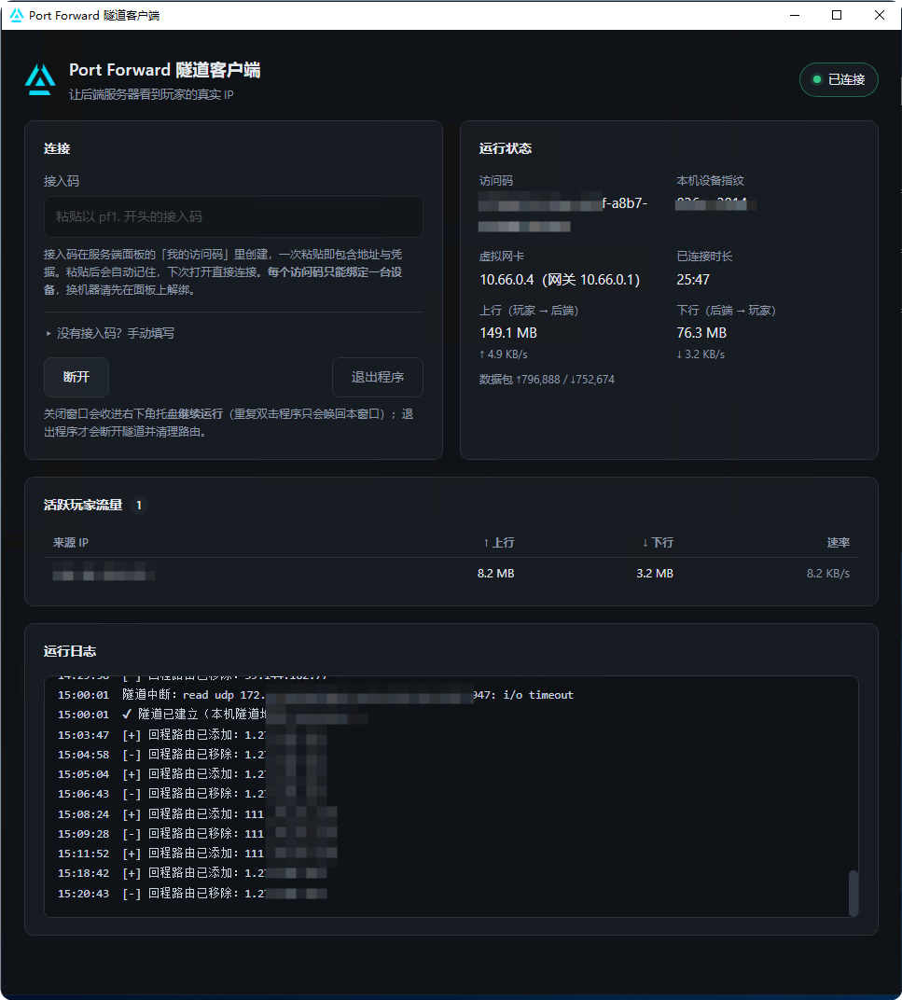

# Port Forward 隧道客户端（pf-client）

自研迷你加密隧道（UDP + 每访问码密钥握手 + X25519 密钥协商 + ChaCha20-Poly1305 每包加密
+ 收发方向密钥分离 + 设备绑定），
为「中转 Linux VPS → 海外 Windows 游戏服务器」拓扑提供回程路径，配合
go-port-forward 的规则级**透明模式**实现后端零插件看到玩家真实 IP。

```
玩家P ──► [中转 Linux VPS]                        [Windows / BDS]
          go-port-forward（透明模式：                 ▲ pf-client
            源地址=P真实IP）──► 路由进 TUN ══加密隧道══╝ (10.66.0.x)
          内置隧道服务端 (TUN 10.66.0.1)
          策略路由把回包交回透明 socket ──► 玩家P ◄──┘
```

隧道服务端已集成进 go-port-forward 主程序（`tunnel.enabled: true`），
**没有独立的服务端进程**，本目录只构建 Windows 客户端。



隧道是**多用户**的：每个隧道用户有独立密钥与独立的 `10.66.0.x` 地址，
客户端的地址不再是编译期常量，而是握手成功时由服务端下发。

## 构建

```bash
bash app/build.sh
```

产物是 `app/bin/` 下的两个文件：`pf-client.exe` + `wintun.dll`
（后者是 WireGuard 官方签名 DLL，许可证允许随软件再分发）。两个文件同目录分发，
目标机器**无需 Go 环境**。

> 只有 `app/bin/pf-client.exe` 是正式产物。直接跑 `go build ./cmd/client/` 会在包目录
> 留一个同名程序，但它缺少 `-H=windowsgui`，运行时会多弹一个黑色控制台窗口。
> `build.sh` 每次都会清掉它，`.gitignore` 也拦着，别拿它去分发。

## 中转机（Linux，root）

在 go-port-forward 的 `config.yaml` 里开启：

```yaml
tunnel:
  enabled: true
  listen: ":7947"
  tun_addr: 10.66.0.1/16     # 服务端地址 + 访问码地址池（一个访问码占一个地址；/16 约 6.5 万个位置，/24 只有 253 个）
  public_addr: "1.2.3.4:7947" # 兜底用：写进接入码的公网地址。优先用面板「全局设置」里的中转机地址，两处都未配置时自动探测公网 IP
  nat: true                   # 自动配 ip_forward + 策略路由 + FORWARD/INPUT 放行
```

启动主程序即可，防火墙放行 UDP 7947。注意这里**不使用 MASQUERADE**——透明模式下
正向首包走 OUTPUT 不匹配任何 NAT 规则，conntrack 会判定整条流不做 NAT，反向包即使
命中 MASQUERADE 也不会改写。回程靠 fwmark + 专用路由表把包交回透明 socket。

`tunnel.psk` 已废弃（多用户协议为每个用户分配独立密钥）。旧配置文件仍能加载，
该项被忽略并在启动时告警一次。

## 获取接入码

用户在面板侧边栏「我的访问码」里**自助**创建访问码（数量受套餐配额约束），
点「接入码」复制整串凭据——`pf1.` 开头的字符串，内含中转机地址、访问码 ID
与隧道密钥。管理员也可以在「用户管理」进入某用户的访问码列表代为创建。

接入码等同于密码。密钥泄漏时用「重新生成密钥」按钮，旧接入码立即失效，
绑定的客户端也会被立即断开。

### 设备绑定

**每个访问码只能绑定一台设备**：首次连接成功时自动登记本机的设备指纹，之后
其它设备连接会被拒绝（客户端会显示明确原因，而不是"无应答"）。

- **换机器**：先在面板上对该访问码点「解绑」（旧设备的隧道会立即断开），
  再到新机器上连接，首次连接即绑定新设备。
- **本机指纹**显示在客户端界面上（形如 `a1b2…f9`），报障时请把它和面板上
  的绑定记录对照。
- 指纹派生自 Windows 注册表的 MachineGuid：系统重装、改注册表都会变化
  （表现为需要解绑重连）；克隆镜像出来的机器指纹相同（绑定形同虚设）。
  它防的是随手共享，不是有动机的攻击者。

## 客户端（Windows 游戏服务器）

**前置条件：Microsoft Edge WebView2 运行时。** Win11 与近年更新过的 Win10 已预装，
但 **Windows Server 2019 / 2016 以及部分精简版 Windows 10 不带**，需要先装：

- 下载「常青版独立安装程序」（Evergreen Standalone Installer，x64）：
  <https://go.microsoft.com/fwlink/p/?LinkId=2124703>
- 或从 <https://developer.microsoft.com/microsoft-edge/webview2/> 页面选择

缺少它时程序会弹窗说明并附下载地址，不会静默退出。

1. `pf-client.exe` 与 `wintun.dll` 放同一目录，双击运行
2. 程序自动请求管理员权限（虚拟网卡、路由表、防火墙规则都需要）
3. 界面里粘贴**接入码**（凭据会记住，下次启动自动连接）。
   没有接入码时可展开「手动填写」分别填中转机地址、访问码 ID 与隧道密钥
4. 状态变「已连接」即可，界面会显示分配到的隧道地址。关闭窗口会**收进右下角托盘
   继续运行**，托盘右键菜单可显示界面 / 断开连接 / 退出程序；只有「退出程序」才会
   清理路由与防火墙规则

凭据存在 exe 同目录的 `pf-client.conf`（YAML，权限 0600，含隧道密钥）。旧版本那份
「一行裸地址」的配置能被识别并保留地址，但没有凭据，需要粘一次接入码。

程序是**单实例**的：关窗后再双击 exe 只会把已有窗口唤回前台，不会启动第二个。
多用户版服务端已按用户分槽，不再存在「多客户端抢占同一会话」的问题；但同机多实例
仍会撞在一批**机器级全局资源**上——虚拟网卡名、按名删除的防火墙规则、系统路由表
条目、`pf-client.conf`。任何一个实例退出都会连带删掉另一个的防火墙规则与路由，
症状仍是"包在往返但进不去游戏"。所以单实例保留。

界面是原生窗口，由 WebView2 渲染，分四块：

- **连接**：粘贴接入码（或展开「手动填写」分别填中转机地址 / 访问码 ID / 隧道密钥）、断开与退出按钮，以及关窗收进托盘的说明。
- **运行状态**：访问码与本机设备指纹、分配到的虚拟网卡地址（含网关与协商到的 MTU）、已连接时长、上行 / 下行字节数与实时速率、数据包收发计数。
- **链路质量**：丢包率、乱序率、抖动、往返延迟、纠错补回数、本地丢弃数。丢包率与乱序率要**分开看**——高乱序而低丢包是正常的多路径链路，不影响游戏；丢包率超过 1% 才是体感分界（60pps 下 1% 约等于每秒卡 0.6 次）。
- **活跃玩家流量**：每个来源 IP 的上下行流量、速率与丢弃数——排查「包在往返但进不去游戏」先看这里有没有数据。
- **运行日志**：最近的握手、回程路由增删与异常事件。

**启动异常时**看 exe 同目录的 `pf-client.log`——每次启动都会重写，记录系统版本、
提权状态、WebView2 版本与各步骤结果。GUI 程序没有控制台，这是唯一的现场证据。

回程路由为**动态 /32**：只有正在经过中转的玩家 IP 走隧道返回，Windows 机器的其它
上网 / RDP 流量完全不受影响。路由在收到玩家入站包时即时安装（探测器这类"一来一回"
的交互等不到服务端的 10 秒周期推送）。回收遵循「事件建立、时间回收」：服务端在活跃
列表出现「上轮在、本轮不在」时下发会话结束通知，客户端再等 20 秒删除；收不到通知时
由本地空闲计时兜底，90 秒无入站包即删除，整体窗口约 1 分钟。服务端的周期推送**按
规则归属分组**，客户端只会收到自己名下规则上的玩家 IP。

## 隧道 MTU

虚拟网卡的 MTU 由服务端在握手应答里下发（进 MAC，中间人改不了）：取「中转机出口
网卡 MTU − 53 字节封装开销」与协议上限 1400 的较小值，服务端开启前向纠错时再让出
83 字节给校验包。客户端另有一次被动探测——心跳载荷填充到满尺寸，服务端回显它实际
收到的长度，连续三轮收不到回显就下调一档并写日志。

为什么要这么较真：IP 分片**丢任意一片等于整个隧道包全损**，而这类丢失在应用层看
不出与普通丢包的区别。固定 1400 在 PPPoE(1492)、部分 4G 与企业 VPN 上会贴上限，
叠加一层封装就超。

## 与 go-port-forward 的配合

中转机上转发规则的目标地址填**该用户的隧道地址**`:BDS端口`（在用户管理里可见；
管理员在规则表单里选「所属用户」会自动带出），并在规则上开启**透明模式**
（`transparent`，仅 Linux+root 可用，且仅支持 UDP）——转发器以玩家真实 IP:端口
为源地址经隧道送达 BDS，BDS 零插件看到真实玩家 IP。

普通用户在面板里建规则时，目标地址被强制锁定为自己的隧道地址，且监听端口必须落在
管理员分配的端口区间内。

## 排查

| 现象 | 检查 |
|------|------|
| 双击没反应、无窗口无报错 | 看 exe 同目录 `pf-client.log`。最常见原因是**缺 WebView2 运行时**（Server 2019/2016 不预装），见上文前置条件；日志若显示"已有实例在运行"则属正常（单实例） |
| 隧道时断时续、包在往返但进不去游戏 | 任务管理器确认只有**一个** `pf-client.exe`（机器级资源互斥，见上文） |
| 握手一直失败 | 两端放行 UDP 7947；中转机 `tunnel.enabled` 是否开启；服务端日志若提示「协议版本过旧」说明客户端要升级，若提示「握手认证失败」说明接入码已失效，在面板重新获取 |
| 界面提示「中转机的服务端版本过旧」 | 隧道协议已升到 v4（方向密钥分离 + AEAD），**两端必须成对升级**。先升中转机的服务端，再升客户端 |
| 界面提示「配置里没有接入凭据」 | 从旧版本升级上来的配置只有地址。在面板「我的访问码」复制接入码粘进输入框 |
| 提示「这个访问码已经绑定到另一台设备」 | 该访问码绑定了别的机器。在面板上解绑后重连，或改用一个未绑定的访问码。此错误不会自动重试 |
| 提示「同时在线的隧道数已达上限」 | 你名下有别的机器还连着。先在那边断开，或联系管理员提高组配额。此错误会自动重试 |
| 提示「这个访问码已被停用 / 账号已被停用」 | 找管理员或在面板里重新启用。此错误不会自动重试 |
| 服务端日志「丢弃源地址不匹配的隧道包」 | 虚拟网卡地址与服务端分配的不一致。正常情况下地址由握手下发不会错，出现这条要查是否有人手工改过网卡地址 |
| 隧道已连接但业务不通 | 界面「活跃玩家流量」是否出现玩家 IP，上下行字节是否**同时**增长；只有一个方向说明回程路径有问题 |
| 能进游戏但列表探测失败 | 客户端版本过旧（入站首包即时补路由是后来才加的） |
| 时间相关的握手失败 | 两端时钟偏差需小于 10 分钟 |
| 「链路质量」丢包率偏高 | 先判断是不是自家链路：同一中转机上多个客户端一起高＝中转机侧或公网骨干，只有这台高＝本机上行。确认是链路丢包后可让管理员开 `tunnel.fec`（每 8 包附 1 个校验包，组内丢 1 个可无损补回）；丢包 <1% 时开它是纯浪费 |
| 「链路质量」里「本地丢弃」非零 | 有玩家在进服瞬间被本机丢过包（回程路由安装缓冲溢出）。偶发可忽略；持续出现看日志里的「回程路由安装失败」，通常是 route.exe 被安全软件拦了 |
| 日志「路径 MTU 探测失败，下调至 …」 | 链路实际 MTU 小于按出口网卡算出的值（PPPoE / 4G / 企业 VPN 常见）。这是自动适配，不是故障——下调后大包不再被分片，而分片丢一片等于整包全损 |

资源文件（图标）的生成方式见 [cmd/client/README.md](cmd/client/README.md)。
